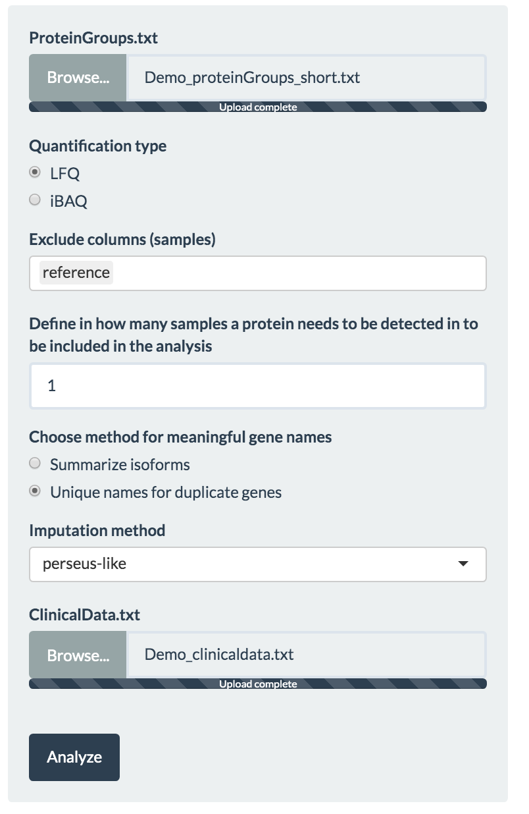
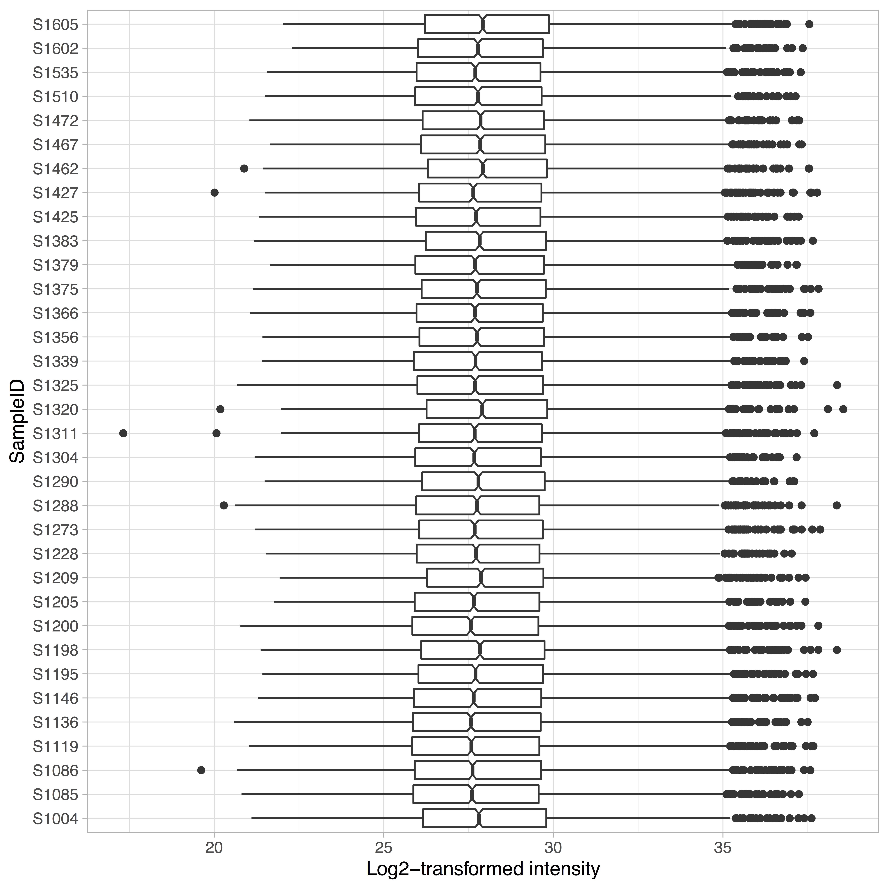
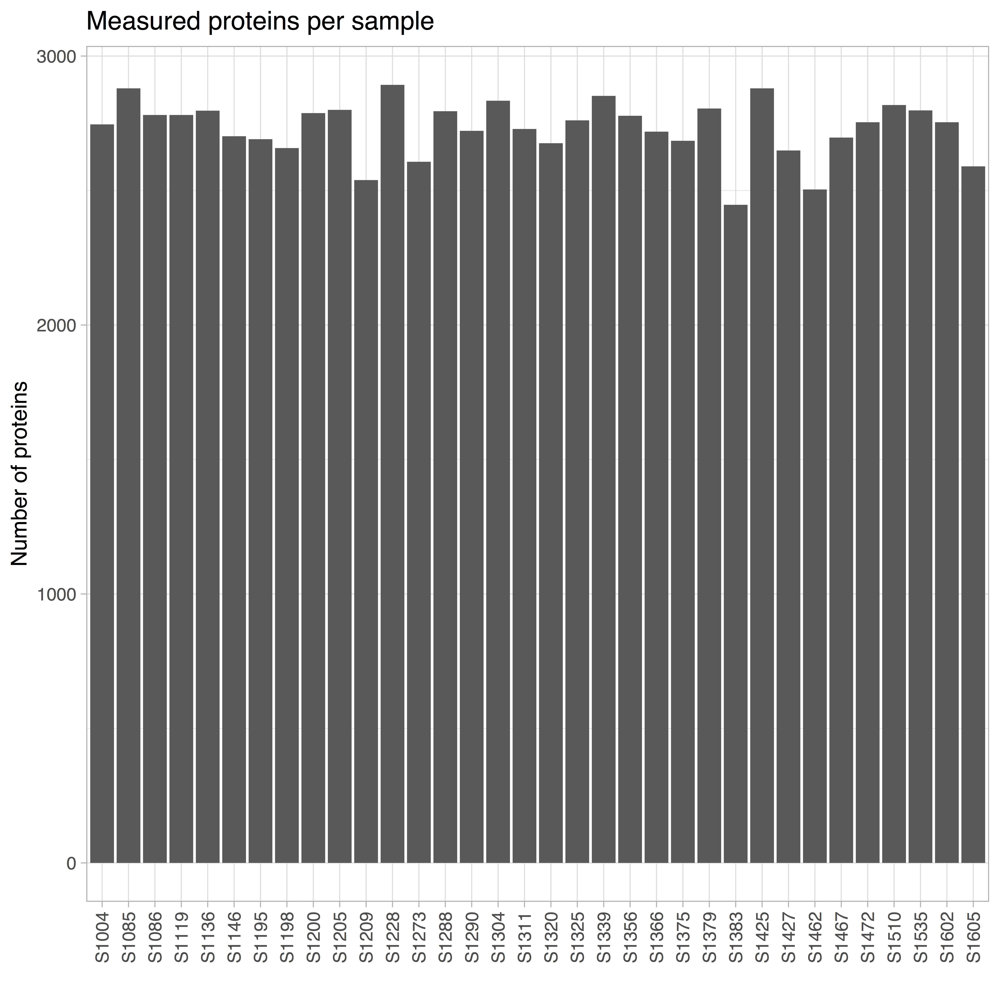
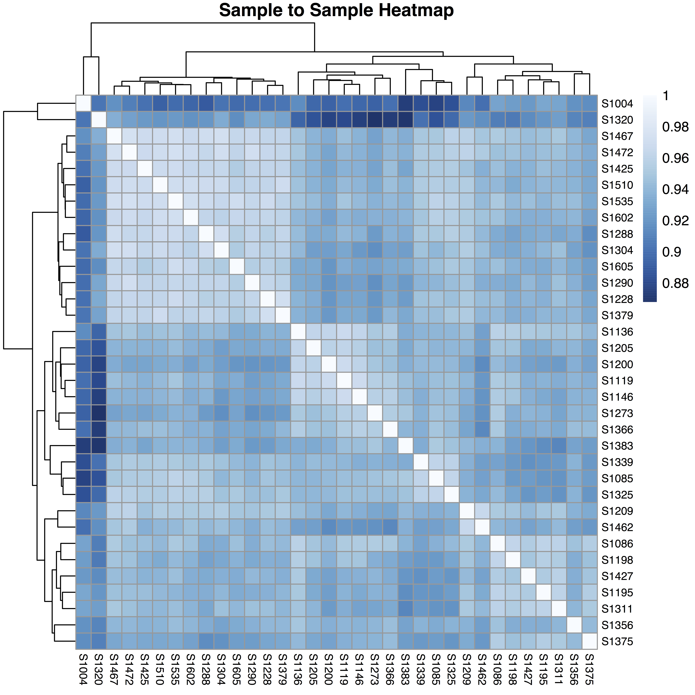
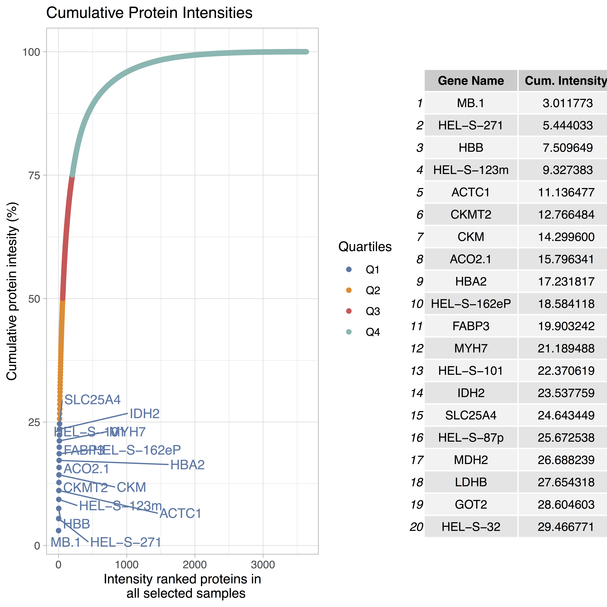

```{r echo=FALSE}
library(kableExtra)
library(shiny)
options(knitr.table.format = "html")
```
<p style='text-align: justify;'> 
Eatomics is an [R-Shiny](https://shiny.rstudio.com/) based web application that enables interactive exploration of quantitative proteomics data generated by [MaxQuant](https://www.nature.com/articles/nprot.2016.136) software. Eatomics enables fast exploration of differential expression and pathway analysis to researchers with limited bioinformatics knowledge. The application aids in quality control of the quantitative proteomics data, visualization, differential expression and pathway analysis. Highlights of the application are an extensive experimental setup module, the data and report generation feature and the multiple ways to interact and customize the analysis.
</p>

# 1. Input files{#InputFiles}
<p style='text-align: justify;'> 
Eatomics requires two file inputs:

1. Demo_proteinGroups.txt: The proteinGroups.txt (i.e. a tab-separated files) as generated by the quantitative analysis software of raw mass spectrometry data - MaxQuant. The file should contain at least the columns Protein IDs, Majority protein IDs, Gene names, LFQ/iBAQ measurement columns, Reverse, Potential contaminant, Only identified by site. The latter three may be empty.

2. Demo_clinicaldata.txt: The sample description file - a tab separated text file as can be produced with any Office program by saving the spread sheet as .txt. The  file needs to contain a column named "PatientID", which contains IDs that match the sample ID's from the proteinGroups header (without the "LFQ intensity" or "iBAQ" prefixes) and one or more named columns with "parameters", i.e. textual/factual/logical or continuous/integer values. Column names have to be unique.

`r shiny::icon("edit")`<span style="color:gray"> The name of the samples shall be identical in both input files. Also, represent character variables as 'factor' and integers as 'numeric'.
Please note that ordinal values are treated as numeric.
 text</span>
 
Access to demo data is possible directly via the upload button if ou are testing on our public server. For your local installation you may directly use your own data or the demo files in Eatomics/Data from the github repository. 
</p>
# 2. Application walk-through {.tabset .tabset-fade .tabset-pills}

Eatomics functionality is structured into four tab panels:

* **Load and Prepare** raw data on samples and MaxQuant output, as well as quality control. 
* Conduct **differential expression** analysis. 
* Calculate enrichment scores per sample (**ssGSEA**). 
* Conduct **differential enrichment** analysis. 

All tabs consist of a side panel to configure the analysis and a main panel for interactive analysis visualization.

## Step 1: Load and Prepare{#lnp}
<p style='text-align: justify;'> 
The first tab provides an overview on the data quality and enables filtering and preparation of data for differential expression and enrichment analysis (\autoref{fig:app_overview_LnP}).

### Configuration panel 
Within the side panel the user can load data and configure quality control options.

<div class = "row">
<div class = "col-md-8">
#### Load proteinGroups.txt input file
To begin the analysis the user has to upload the MaxQuant file (e.g.proteinGroups.txt), as specified [above](#InputFiles). After full upload of the file, rows that were only found in the reverse database, belonging to potential contaminants or that have only been identified by site are filtered automatically. 

#### Quality control and data cleansing

* The user selects either LFQ (Label-free quantification) or iBAQ (Intensity Based Absolute Quantification) as intensity metric to be considered for succeeding differential expression analysis. If available, we suggest to use LFQ intensities as Eatomics was optimized for these. Internally, the `r text_spec("intensity", background = "#2C3E50", color = "white", bold = T)` widget uses the *selectProteinData* function. 


* The `r text_spec("exclude column", background = "#2C3E50", color = "white", bold = T)` widget allows the user to exclude samples, especially if any outliers are found while conducting initial quality analysis such as PCA. Selecting a sample here, results in the removal of that sample from the consecutive steps analysis steps.

* To avoid proteins with many missing values across the samples, the user selects the minimum number of samples for which a protein must have been detected in. Internally the `r text_spec("filter", background = "#2C3E50", color = "white", bold = T)` widget uses the *filterProteins* function.

* `r text_spec("Meaningful gene names", background = "#2C3E50", color = "white", bold = T)`: As genes names are easier to interpret than peptide identifiers, the gene names are displayed primarily. As gene names can be non-unique, the user can choose to let Eatomics 
    + prepare unique IDs for duplicate gene names or (make.unique() R base function)
    + to sum up multiple abundance values for one gene name (*checkForIsoforms* custom function). 
In the latter case, the user is informed about intensity shares. 

* `r text_spec("Missing value imputation", background = "#2C3E50", color = "white", bold = T)` can be performed using knn (k-nearest-neighbour), MinDet or QRLIC from the imputeLCMD package or a custom implementation of Perseus' sampling from Gaussian distribution (implemented by Matthias Ziehm). 


#### Load the sample description/clinical data file
Select and load the clinical data input file (e.g clinicaldata.txt), as specified [above](#InputFiles).

</div>
<div class = "col-md-4">

</div>
</div>

### Visualization panel
In the main panel (right) interactive visualizations are shown. 

<div class = "row">
<div class = "col-md-8">
#### Principal component analysis  

A common method of dimensionality reduction is principal component analysis (PCA). Inherently,
PCA calculates axes of most variation (principal components) within the expression data. A common assumption is that a plot along the axes of most variation will segregate all samples/patients into groups under investigation. 
The user can choose which principle components to visualize in the PCA and can choose to color the samples based on the uploaded sample/clinical characteristics. 
</div>

<div class = "col-md-4">

</div>
<div class = "col-md-8">
#### Distribution overview
Protein numbers describes the count of distinct proteins or isoforms per sample. The plot is generated by the plot_numbers() function from the DEP package which was adjusted to work without experimental design information. 

</div>
<div class = "col-md-4">

</div>

#### Protein coverage
<div class = "col-md-8">
Protein numbers describes the count of distinct protein groups per sample.
</div>
<div class = "col-md-4">

</div>

#### Sample to sample heatmap 
<div class = "col-md-8">
The sample-to-sample heatmap describes the biological and/or technical variability of the samples. The user can choose to use Euclidean distance or Pearson correlation as a (dis-)similarity metric. Formed clusters should resemble the sample groups under investigation. 
</div>

<div class = "col-md-4">

</div>
#### Cumulative Protein Intensities 
<div class = "col-md-8">
Protein intensities are cumulated across all samples and plotted according to their relative abundance. Colouring marks the respective quantile of the proteins. Highly abundant proteins, i.e., proteins ranked in the first quartile are colored in red and labels are specified. The top 20 ranked proteins and their cumulated intensity are given in the table to the right.
</div>
<div class = "col-md-4">

</div>
</div>
</div>
</p>
## Step 2: Differential expression
<p style='text-align: justify;'> 
In step 2, the user is enabled to translate a given hypothesis on the data into an experimental design and to test the hypothesis.
<br />**Eatomics** uses limma to perform real time analysis of differentially expressed proteins amongst clinical parameters of choice. The resulting interactive visualization plot including volcano plots (detailed below) allows a quick and detailed overview on the differential expression.
[limma](http://bioconductor.org/packages/release/bioc/html/limma.html) (linear models for microarray data), is a commonly used  R/Bioconductor software package for analyzing microarray and RNA-seq data. Limma functions fit statistical linear models and conduct differential expression analysis.

### Experimental design configuration {#widget}

* The `r text_spec("clinical group", background = "#2C3E50", color = "white", bold = T)` widget allows the user to select the clinical parameter of their choice from the uploaded dataset, to perform limma analysis.

* The `r text_spec("compare", background = "#2C3E50", color = "white", bold = T)` widget shows all the available subgroups inside the selected clinical group. The user then selects **two** subgroups to compare and find the differential expressed genes in the selected subgroups.

* The `r text_spec("surrogate variable", background = "#2C3E50", color = "white", bold = T)` widget uses the [sva{sva}](https://bioconductor.org/packages/release/bioc/html/sva.html) function to remove the unknown source of variation such as batch effects from the expression value of the compared clinical subgroup.
`r shiny::icon("edit")`<span style="color:gray"> 
It is better to impute before, checking surrogate variable, as the sva function works better with non-missing values

* The `r text_spec("impute values", background = "#2C3E50", color = "white", bold = T)` provides the user the flexibility to choose the imputed MaxQuant expression values (from the Load and Prep tab)

* The `r text_spec("apply filters", background = "#2C3E50", color = "white", bold = T)` widget allows to extend filter to a second clinical parameter, where the user can narrow down the filtering to very specific subgroup of another clinical parameter of interest

* Using `r text_spec("threshold box", background = "#2C3E50", color = "white", bold = T)` widget, the user can interactively adjust for multiple testing corrected (adjusted) P-value and log FoldChange(logFC) , plotting the genes above the chosen threshold in the volcano plot


### Visualization of differentially expressed proteins

#### Volcano plot {#volcano}

[lmFit{limma}](https://www.rdocumentation.org/packages/limma/versions/3.28.14/topics/lmFit) along with other liner model functions from limma performs the differential expression analysis on the selected clinical group. Later, the resulting [table to top-ranked genes{limma}](https://www.rdocumentation.org/packages/limma/versions/3.28.14/topics/toptable) the volcanoplot is plotted. 
In the plot, the x axis plots the log-2-fold change value (`lfc´ from the table) where logFC> 0 means the genes are up-regulated and logFC<0 meaning genes down regulated in the clinical group selected first (i.e,cases in Fig.5.) and the y axis plots the -log10 of P value (´p.value´) from the gene list. 


```{r fig.align="center" , echo=FALSE, fig.cap="Fig.5.VolcanoPlot" ,out.width="100%" }
#knitr::include_graphics("Screenshots/limma/volcanoplot.png")
```

#### Up and down regulated data table
The list of the genes up and down regulated (once that crosssed the given threshold) and their summary including the gene name, log-2-foldchange, P value and adjusted P value (adj.P.Val) is represented in the respective up and down regulated tables.

```{r fig.align="center" , echo=FALSE, fig.cap="Fig.6.Screenshot of Up and Down regulated gene list ",out.width="100%" }
#knitr::include_graphics("Screenshots/limma/rendertable.png")
```

#### Analysis details

The collapsible  panel contains details on the input paramaters that were selected by the user through the limma widgets.

```{r fig.align="center" , echo=FALSE, fig.cap="Fig.7.Screenshot of Detailed Description collapsible tab panel ",out.width="100%"}
#knitr::include_graphics("Screenshots/limma/detail_descrptn.png")
```

</p>
## Step 3: Enrichment score calculation (ssGSEA) {#ssgsea}
<p style='text-align: justify;'> 
The tab provides an easy to use user-interface on the established [(ssGSEA)](http://software.broadinstitute.org/cancer/software/genepattern/modules/docs/ssGSEAProjection/4) (single-sample Gene Set Enrichment Analysis) method which is an extension of GSEA. The interactive widgets in the tab are developed based on the freely accessed codes developed by Broad institute ^1^. The tab currently focuses only on four  [MSigDB](http://software.broadinstitute.org/gsea/msigdb)(version, v6.1) genesets namely, **H**- hallmark geneset, **C2**- KEGG geneset, **C5**- GO geneset and **C1**- positional geneset to calculate the enrich ment score and the user selects one geneset from these (similar to conventional GSEA).

Later, the resulting output,the .gct files with the respective geneset enrichment score will be  auto-downloaded into the working directory, into the folder called `EnrichmentScore`.

 
 `r shiny::icon("edit")`<span style="color:gray"> A message alert will be pop-up on download completion.


<details><summary>**Screenshot of the ssGSEA widgets**</summary>

```{r fig.align="center", fig.cap ="Fig.8.Screenshot of ssGSEA tab panel ",out.width = "60%", echo = FALSE}

#knitr::include_graphics("Screenshots/ssgsea/a_ssgsea_widget.png")

``` 

</p>
## Step 4: Differential enrichment
<p style='text-align: justify;'> 
Differential expression analysis of the pathways enriched via ssGSEA (using the previou tabpanel) in the clinical group of interest,is facilitated by the tab. The pathway enrichment scores geneset
is tested for differential pathway expression using [t.test](https://www.rdocumentation.org/packages/stats/versions/3.6.0/topics/t.test). The test compares the enriched pathways differential expressed among two clinical conditions selected.

### Experimental design configuration {#widget}

* The `r text_spec("Gene Set Collection", background = "#2C3E50", color = "white", bold = T)` widget allows the user to select the geneset of his choice (from the available). On selecting the geneset, the file is auto-uploaded from `EnrichmentScore` folder, provided the user has saved the file using ssGSEA tab. 

`r shiny::icon("edit")`<span style="color:gray"> 
The score file is [`.gct`](http://software.broadinstitute.org/cancer/software/genepattern/file-formats-guide#gct) file, a **m x n** matrix where **m** rows contain the name of the pathway from the selected  geneset and **n** number of column represents the sample names matching to the clinical data. 
<br/>
Make sure the sample names (column names) format in the geneset collection matches to the sample names (PatientID) in the clinical data file.
 text</span>

*Rest of the widgets in the panel follows the same pattern in the 'differential limma' tab

### Visualization of differentially enriched pathways and gene sets

#### Volcano plot 

The interactive volcanoplot plots the log ratio (x-axis) vs -log10 of P value calsulated based of t.test. The  bonferroni adjusted P value (adj.p< 0.05) is selected as the threshold to highlight the differentially expressed pathways. 

```{r fig.align="center" , echo=FALSE, fig.cap="Fig.9.Screenshot of VolcanoPlot",out.width="100%" }
#knitr::include_graphics("Screenshots/diff_ssgsea/volcanoplot.png")
```

`r shiny::icon("edit")`<span style="color:gray">  The other two result formats including interactive data table and the detailed description panel lists the highlighted up and and down regulated pathways and details on the input parameters, respecively.

<!--

## 4.Session information
-->
</p>
# 3. References
1: Krug, K., et al., A Curated Resource for Phosphosite-specific Signature Analysis. Mol Cell Proteomics, 2019. 18(3): p. 576-593.

2: Ritchie, Matthew E., et al. "limma powers differential expression analyses for RNA-sequencing and microarray studies." Nucleic acids research 43.7 (2015): e47-e47.

3: Lazar, C., "imputeLCMD: a collection of methods for left-censored missing data imputation." R package, version 2 (2015).

# 4. Gitlab Folder layout
``` 
Shiny R package
 
`r shiny::icon("folder")` R
    |app.R
    |helpers.R
    |run_app_function.R
`r shiny::icon("folder")` vignettes
    |About.rmd 
    |
`r shiny::icon("folder")` man
    |helpers_roxygen.R
    |
`r shiny::icon("folder")` markdown_docs
    |Tutorial.rmd
    |About.rmd
`r shiny::icon("folder")` input_files
    `r shiny::icon("folder")` MSData
         |proteinGroups.txt
    `r shiny::icon("folder")` ClinicalData
         |clindata.txt
`r shiny::icon("folder")` Datasets
    `r shiny::icon("folder")` MSigDB
        |c1.all.v6.1.symbols.gmt
        |c2.cp.kegg.v6.1.symbols.gmt
        |c5.all.v6.1.symbols.gmt
        |h.all.v6.1.symbols.gmt
    `r shiny::icon("folder")` TranscriptionFactors
        |GATA-familyHuman230318.txt
        |JUN-familyHuman230318.txt
        |SH2-familyHuman230318.txt
        |SOX-familyHuman230318.txt
        |TBX-familyHuman230318.txt
    `r shiny::icon("folder")` EnrichmentScore
`r shiny::icon("folder")` Report
    |
|DESCRIPTION
    |
|NAMESPACE
    |
|README.md
    |


```

