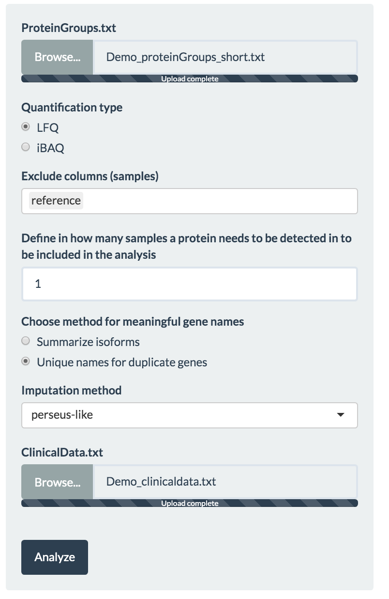
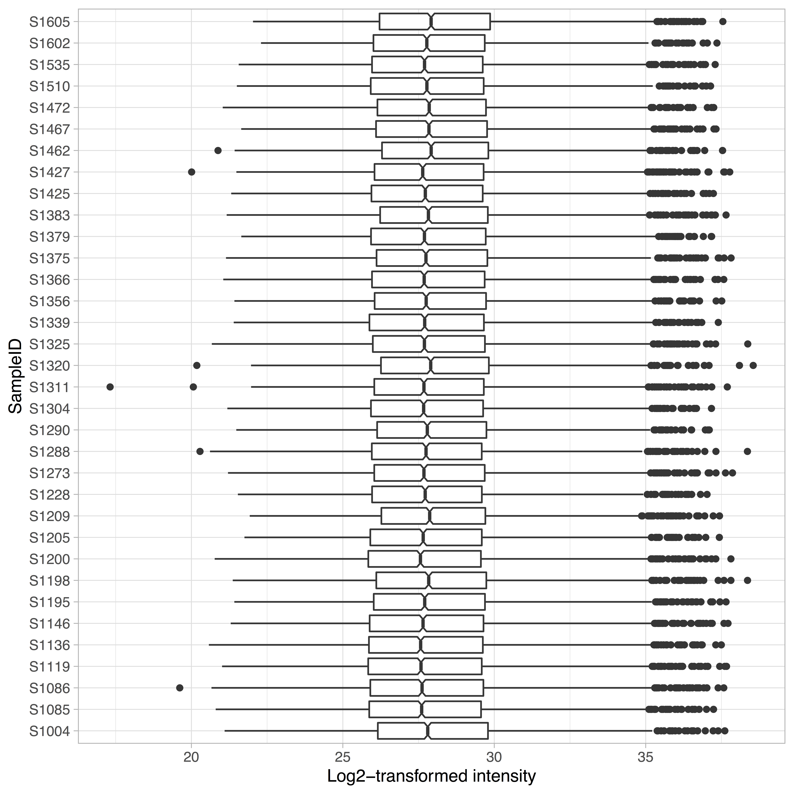

```{r echo=FALSE, message=FALSE, warning=FALSE}
library(kableExtra)
library(shiny)
options(knitr.table.format = "html")
```

<style>
.column-left-full{
  float:left;
  width: 100%;
  text-align: justify
}
.column-left{
  float: left;
  width: 70%;
  text-align: justify;
}
.column-right{
  float: right;
  width: 30%;
  text-align: center;
}
</style>

<div class = "column-left-full">
Eatomics is an [R-Shiny](https://shiny.rstudio.com/) based web application that enables interactive exploration of quantitative proteomics data generated by [MaxQuant](https://www.nature.com/articles/nprot.2016.136) software. Eatomics enables fast exploration of differential expression and pathway analysis to researchers with limited bioinformatics knowledge. The application aids in quality control of the quantitative proteomics data, visualization, differential expression and pathway analysis. Highlights of the application are an extensive experimental setup module, the data and report generation feature and the multiple ways to interact and customize the analysis.

# 1. Input files{#InputFiles}

Eatomics requires two file inputs:

1. Demo_proteinGroups.txt: The proteinGroups.txt (i.e. a tab-separated files) as generated by the quantitative analysis software of raw mass spectrometry data - MaxQuant. The file should contain at least the columns Protein IDs, Majority protein IDs, Gene names, LFQ/iBAQ measurement columns, Reverse, Potential contaminant, Only identified by site. The latter three may be empty.

2. Demo_clinicaldata.txt: The sample description file - a tab separated text file as can be produced with any Office program by saving the spread sheet as .txt. The  file needs to contain a column named "PatientID", which contains IDs that match the sample ID's from the proteinGroups header (without the "LFQ intensity" or "iBAQ" prefixes) and one or more named columns with "parameters", i.e. textual/factual/logical or continuous/integer values. Column names have to be unique.
 
Access to demo data is possible directly via the upload button if ou are testing on our public server. For your local installation you may directly use your own data or the demo files in Eatomics/Data from the github repository. 

{ width=100% }

# 2. Application walk-through {.tabset .tabset-fade .tabset-pills}

Eatomics functionality is structured into four tab panels:

* **Load and Prepare** raw data on samples and MaxQuant output, as well as quality control. 
* Conduct **differential expression** analysis. 
* Calculate enrichment scores per sample (**ssGSEA**). 
* Conduct **differential enrichment** analysis. 

All tabs consist of a side panel to configure the analysis and a main panel for interactive analysis visualization.

## Step 1: Load and Prepare{#lnp}

The first tab provides an overview on the data quality and enables filtering and preparation of data for differential expression and enrichment analysis (\autoref{fig:app_overview_LnP}).

</div>

<div class = "column-left">

### Configuration panel 

Within the side panel the user can load data and configure quality control options.

#### Load proteinGroups.txt input file

To begin the analysis the user has to upload the MaxQuant file (e.g.proteinGroups.txt), as specified [above](#InputFiles). After full upload of the file, rows that were only found in the reverse database, belonging to potential contaminants or that have only been identified by site are filtered automatically. 

#### Quality control and data cleansing

* The user selects either LFQ (Label-free quantification) or iBAQ (Intensity Based Absolute Quantification) as intensity metric to be considered for succeeding differential expression analysis. If available, we suggest to use LFQ intensities as Eatomics was optimized for these. Internally, the `r text_spec("intensity", background = "#2C3E50", color = "white", bold = T)` widget uses the *selectProteinData* function. 
* The `r text_spec("exclude column", background = "#2C3E50", color = "white", bold = T)` widget allows the user to exclude samples, especially if any outliers are found while conducting initial quality analysis such as PCA. Selecting a sample here, results in the removal of that sample from the consecutive steps analysis steps.
* To avoid proteins with many missing values across the samples, the user selects the minimum number of samples for which a protein must have been detected in. Internally the `r text_spec("filter", background = "#2C3E50", color = "white", bold = T)` widget uses the *filterProteins* function.
* `r text_spec("Meaningful gene names", background = "#2C3E50", color = "white", bold = T)`: As genes names are easier to interpret than peptide identifiers, the gene names are displayed primarily. As gene names can be non-unique, the user can choose to let Eatomics
    + prepare unique IDs for duplicate gene names or (make.unique() R base function)
    + to sum up multiple abundance values for one gene name (*checkForIsoforms* custom function). 
In the latter case, the user is informed about intensity shares. 
* `r text_spec("Missing value imputation", background = "#2C3E50", color = "white", bold = T)` can be performed using knn (k-nearest-neighbour), MinDet or QRLIC from the imputeLCMD package or a custom implementation of Perseus' sampling from Gaussian distribution (implemented by Matthias Ziehm). 

#### Load the sample description/clinical data file

Select and load the clinical data input file (e.g clinicaldata.txt), as specified [above](#InputFiles).

</div>

<div class = "column-right">

{ width=90% }

</div>

<div class = "column-left">

### Visualization panel

In the main panel (right) interactive visualizations are shown. 

#### Principal component analysis  

A common method of dimensionality reduction is principal component analysis (PCA). Inherently,
PCA calculates axes of most variation (principal components) within the expression data. A common assumption is that a plot along the axes of most variation will segregate all samples/patients into groups under investigation. 
The user can choose which principle components to visualize in the PCA and can choose to color the samples based on the uploaded sample/clinical characteristics. 

#### Distribution overview

The distribution overview gives an impression on the sample-wise distribution of all measured intensities.

#### Protein coverage

Protein coverage describes the count of distinct protein groups per sample.

#### Sample to sample heatmap 

The sample-to-sample heatmap describes the biological and technical variability of the samples. The user can choose to use Euclidean distance or Pearson correlation as a (dis-) similarity metric. Formed clusters should resemble the sample groups under investigation.

#### Cumulative Protein Intensities 

Protein intensities are cumulated across all samples and plotted according to their relative abundance. Colouring marks the respective quantile of the proteins. Highly abundant proteins, i.e., proteins ranked in the first quartile are colored in red and labels are specified. The top 20 ranked proteins and their cumulated intensity are given in the table to the right.

</div>


<div class = "column-right">

{ width=90% }

{ width=90% }

</div>

<div class = "column-left-full">

  <div class = "col-md-4"> { width=90% } </div>

  <div class = "col-md-4"> { width=90% } </div>

  <div class = "col-md-4"> { width=90% } </div>

</div>

<div class = "column-left-full">

## Step 2: Differential expression

In step 2, the user is enabled to translate a given hypothesis on the data into an experimental design and to test the hypothesis.
**Eatomics** uses limma to perform real time analysis of differentially expressed proteins amongst clinical parameters of choice. 
The resulting interactive visualization plot including volcano plots (detailed below) allows a quick and detailed overview on the differential expression.
[limma](http://bioconductor.org/packages/release/bioc/html/limma.html) (linear models for microarray data), is a commonly used  R/Bioconductor software package for analyzing microarray and RNA-seq data. 
Limma fits a linear model which can be parametrized in Eatomics elaborate experimental design module.<br />

</div>

<div class = "column-left">

### Experimental design configuration {#widget}

* The `r text_spec("clinical grouping factor", background = "#2C3E50", color = "white", bold = T)` widget allows the user to select the clinical parameter of their choice from the uploaded dataset. 

* In case the first grouping factor is categorical, the `r text_spec("compare", background = "#2C3E50", color = "white", bold = T)` widget shows all the available subgroups inside the selected clinical group. The user then selects **two** subgroups to compare and find the differential expressed genes in the selected subgroups.

* In case of the first grouping factor being numeric, the `r text_spec("select threshold", background = "#2C3E50", color = "white", bold = T)` widget appears and asks the user to specify a threshold, e.g., in the case of age, the user would split the cohort into a young and and old group, based on the given age at which to split. Automatically the two resulting groups are compared. 

* Alternatively, the option to `r text_spec("use continuous response", background = "#2C3E50", color = "white", bold = T)` may be checked. Eatomics then ignores the threshold and performs the analysis based on the continuous value. Please take special caution on how to interpret the results. 

* By checking the `r text_spec("impute missing values", background = "#2C3E50", color = "white", bold = T)` box, Eatomics uses the imputed data using the method specified in the previous tab. However, in the background Eatomics performs a filter on imputed data, which leads to exclusion of proteins, for which there are fewer than 50 % of measured values in both compared groups available. As a result proteins may be found to be upregulated in one group although the protein was just not detected in the other group. If the box is not checked, the limma function does perform it's own missing value imputation. 

* `r text_spec("Include covariates", background = "#2C3E50", color = "white", bold = T)` activates the selection of parameters from the sample description file to be included into the experimental design model. As many covariates as reasonable, i.e., factors that may influence the expression, but are not of primary interest for the current analysis, can be selected.

* A checkmark in `r text_spec("stratification or filter", background = "#2C3E50", color = "white", bold = T)` expands a selection ver similar to the first part of the module and leads Eatomics to consider further specification of the design.

* Along the line of the first part, a `r text_spec("second parameter", background = "#2C3E50", color = "white", bold = T)` can be selected. The second paramater must be categorical, which means that a threshold for continuous parameters has to be selected. As a result, new combined groups appear and can be selected to resemble the stratified contrast of interest. In the case of the first parameter being continuous the second parameter can be considered as a filter which only includes the groups selected in the second part in the experimental design. 

* The `r text_spec("analyze button", background = "#2C3E50", color = "white", bold = T)` starts the analysis and should be used whenever a new design has been configured. 

</div>

<div class = "column-right">

{ width=90% }

{ width=90% }

</div>

<div class = "column-left">

### Visualization of differentially expressed proteins

The result of differential expression analysis is displayed in an interactive volcano plot, two tables of up- and downregulated proteins and box and scatter plots of actual protein abundance.

#### Volcano plot {#volcano}

The volcano plot shows the log2 fold change value on the x-axis and the negative log10 of the Benjamini-Hochberg adjusted p-value on the y-axis. 
Significant results are shown in yellow. 
The threshold of log2 fold change and p-values considered significant can be set by the user directly within the `r text_spec("threshold box", background = "#2C3E50", color = "white", bold = T)`. 
A `r text_spec("hover over", background = "#2C3E50", color = "white", bold = T)` a dot in the volcanoe plot will display the respective gene name. 
A positive fold change can be interpreted as that protein being higher in abundance in the first selected group when compared to the second, in the case of a categorical response. When a continuous response is modeled, the fold change has to be interpreted as the slope, i.e., increase (positive log2 fold change) or decrease (negative log2 fold change), of the protein abundance with regard to a change of one unit of the response variable. For example, if age is analyzed, a log2 fold change of -0.2 would mean a decrease of about 1.15 (2^0.2) in LFQ intensity and thus protein abundance with every year of age. 

#### Result tables and box/scatter plots

Significant results are listed in two tables below the volcano plot. They show the actual logFC, p-value and the adjusted p-value. 
A `r text_spec("click on a protein entry", background = "#2C3E50", color = "white", bold = T)` in the data table produces a box (in the case of a categorical response variable) or scatter plot (in the case of a continuous response variable) showing the actual abundance values of selected proteins with regard to the tested comparisons.  
The color of individual dots can be chosen to reflect a parameter from the sample description file. 

</div>

<div class = "column-right">

{ width=90% }

{ width=90% }

{ width=90% }

</div>


