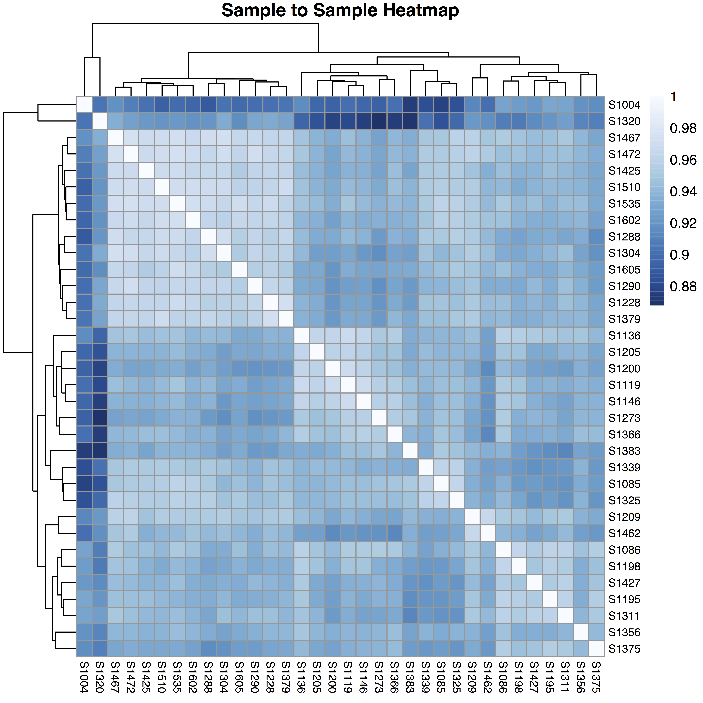
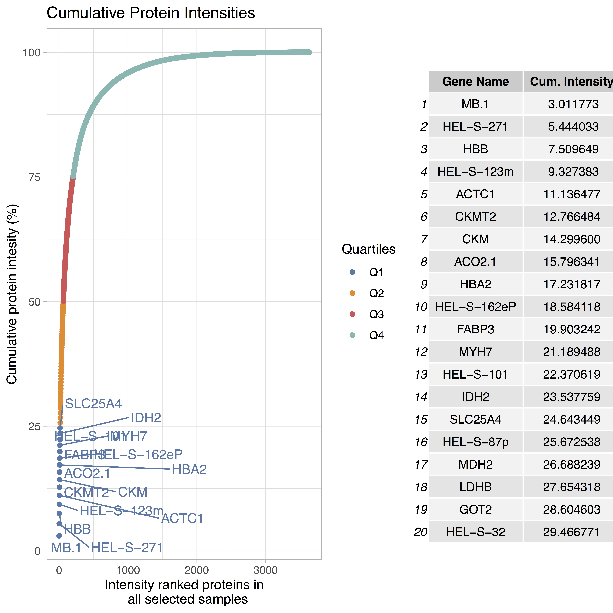

```{r echo=FALSE, message=FALSE, warning=FALSE}
library(kableExtra)
library(shiny)
options(knitr.table.format = "html")
```

<style>
.column-left-full{
  float:left;
  width: 100%;
  text-align: justify
}
.column-left{
  float: left;
  width: 70%;
  text-align: justify;
}
.column-right{
  float: right;
  width: 30%;
  text-align: center;
}
</style>

<div class = "column-left-full">
Eatomics is an [R-Shiny](https://shiny.rstudio.com/) based web application that enables interactive exploration of quantitative proteomics data generated by [MaxQuant](https://www.nature.com/articles/nprot.2016.136) software - specifically label-free quantification (LFQ) and Intensity Based Absolute Quantification (iBAQ) values. Eatomics enables fast exploration of differential abundance and pathway analysis to researchers with limited bioinformatics knowledge. The application aids in quality control of the quantitative proteomics data, visualization, differential abundance and pathway analysis. Highlights of the application are an extensive experimental setup module, the data download and report generation feature and the multiple ways to interact and customize the analysis.

# 1. Input files{#InputFiles}

Eatomics requires two file inputs:

1. Demo_proteinGroups.txt: The proteinGroups.txt (i.e. a tab-separated files) as generated by the quantitative analysis software of raw mass spectrometry data - MaxQuant. The file should contain at least the columns Protein IDs, Majority protein IDs, Gene names, LFQ/iBAQ measurement columns, Reverse, Potential contaminant, Only identified by site. The latter three may be empty.

2. Demo_clinicaldata.txt: The sample description file - a tab separated text file as can be produced with any Office program by saving the spread sheet as .txt. The  file needs to contain a column named "PatientID", which contains IDs that match the sample ID's from the proteinGroups header (without the "LFQ intensity" or "iBAQ" prefixes) and one or more named columns with "parameters", i.e. textual/factual/logical or continuous/integer values. Column names have to be unique.
 
Access to demo data is possible directly via the upload button if ou are testing on our public server. For your local installation you may use your own data or the demo files in Eatomics/Data from the github repository. The demo proteinGroups file represents a shortened version of the data assessed and described in Chen et al. [4] and is accompanied by a sample description file prepared by us, based on the publications supplementary data. 

```{r echo=FALSE}
knitr::include_graphics(path = "https://images.partycity.de/CUTO/38/3/front/v1/pop/4.jpg")
```


# 2. Application walk-through {.tabset .tabset-fade .tabset-pills}

Eatomics functionality is structured into four tab panels:

* **Load and Prepare** raw data on samples and MaxQuant output, as well as quality control. 
* Conduct **differential abundance** analysis. 
* Calculate enrichment scores per sample (**ssGSEA**). 
* Conduct **differential enrichment** (or pathway) analysis. 

All tabs consist of a side panel to configure the analysis and a main panel for interactive analysis visualization.

## Step 1: Load and Prepare{#lnp}

The first tab provides an overview on the data quality and enables filtering and preparation of data for differential abundance and enrichment analysis (\autoref{fig:app_overview_LnP}).

</div>

<div class = "column-left">

### Configuration panel 

Within the side panel the user can load data and configure quality control options.

#### Load proteinGroups.txt input file

To begin the analysis the user has to upload the MaxQuant file (e.g.proteinGroups.txt), as specified [above](#InputFiles). After full upload of the file, rows that were only found in the reverse database, belonging to potential contaminants or that have only been identified by site are filtered automatically. 

#### Quality control and data cleansing

* The user selects either LFQ or iBAQ as intensity metric to be considered for succeeding differential abundance analysis. If available, we suggest to use LFQ intensities as Eatomics was optimized for these. Internally, the `r text_spec("intensity", background = "#2C3E50", color = "white", bold = T)` widget uses the *selectProteinData* function. In the case of iBAQ values, Eatomics performs automatic normalization via limma's normalizeVSN() function. proteinGroups entries (rows) with a "+" in the "Reverse", "Potential contaminant", "Only identified by site" columns are removed automatically. 
* The `r text_spec("exclude column", background = "#2C3E50", color = "white", bold = T)` widget allows the user to exclude samples, especially if any outliers are found while conducting initial quality analysis such as PCA. Selecting a sample here, results in the removal of that sample from the consecutive steps analysis steps.
* To avoid proteins with many missing values across the samples, the user selects the minimum number of samples for which a protein must have been detected in. Internally the `r text_spec("filter", background = "#2C3E50", color = "white", bold = T)` widget uses the *filterProteins* function.
* `r text_spec("Meaningful gene names", background = "#2C3E50", color = "white", bold = T)`: As genes names are easier to interpret than peptide identifiers, the gene names are displayed primarily. As gene names can be non-unique, the user can choose to let Eatomics
    + prepare unique IDs for duplicate gene names or (make.unique() R base function)
    + to sum up multiple abundance values for one gene name (*checkForIsoforms* custom function). 
In the latter case, the user is informed about intensity shares. Within the data download, uniprot accession numbers and protein names (or any other supplied by the MaxQuant output) are given. 
* `r text_spec("Missing value imputation", background = "#2C3E50", color = "white", bold = T)` can be performed using knn (k-nearest-neighbour) from the impute package [5], MinDet or QRLIC from the imputeLCMD package [3] or a custom implementation of Perseus' sampling from a down-shifted Gaussian distribution (implemented by Matthias Ziehm) with default parameters of width = 0.3 and shift = 1.8. 

#### Load the sample description/clinical data file

Select and load the clinical data input file (e.g clinicaldata.txt), as specified [above](#InputFiles).

</div>

<div class = "column-right">

```{r pressure, echo=FALSE, fig.cap="A caption", out.width = '100%'}
#knitr::include_graphics("Images/Eatomics_Load_Panel.png")
```

{ width=90% }

</div>

<div class = "column-left">

### Visualization panel

In the main panel (right) interactive visualizations are shown. 

#### Principal component analysis  

A common method of dimensionality reduction is principal component analysis (PCA). Inherently,
PCA calculates axes of most variation (principal components) within the abundance data. A common assumption is that a plot along the axes of most variation will segregate all samples/patients into groups under investigation. 
The user can choose which principle components to visualize in the PCA and can choose to color the samples based on the uploaded sample/clinical characteristics. 

#### Distribution overview

The distribution overview gives an impression on the sample-wise distribution of all measured intensities.

#### Protein coverage

Protein coverage describes the count of distinct protein groups per sample.

#### Sample to sample heatmap 

The sample-to-sample heatmap describes the biological and technical variability of the samples. The user can choose to use Euclidean distance or Pearson correlation as a (dis-) similarity metric. Formed clusters should resemble the sample groups under investigation.

#### Cumulative Protein Intensities 

Protein intensities are cumulated across all samples and plotted according to their relative abundance. Colouring marks the respective quantile of the proteins. Highly abundant proteins, i.e., proteins ranked in the first quartile are colored in red and labels are specified. The top 20 ranked proteins and their cumulated intensity are given in the table to the right.

</div>


<div class = "column-right">

{ width=90% }

{ width=90% }

</div>

<div class = "column-left-full">

  <div class = "col-md-4"> { width=90% } </div>

  <div class = "col-md-4"> { width=90% } </div>

  <div class = "col-md-4"> { width=90% } </div>

</div>

<div class = "column-left-full">

## Step 2: Differential abundance

In step 2, the user is enabled to translate a given hypothesis on the data into an experimental design and to test the hypothesis.
**Eatomics** uses limma [2] to perform real time analysis of differentially expressed proteins amongst clinical parameters of choice. 
The resulting interactive visualization plot including volcano plots (detailed below) allows a quick and detailed overview on the differential abundance.
[limma](http://bioconductor.org/packages/release/bioc/html/limma.html) (linear models for microarray data), is a commonly used  R/Bioconductor software package for analyzing microarray and RNA-seq data. 
Limma fits a linear model which can be parametrized in Eatomics elaborate experimental design module.<br />

</div>

<div class = "column-left">

### Experimental design configuration {#widget}

* The `r text_spec("clinical grouping factor", background = "#2C3E50", color = "white", bold = T)` widget allows the user to select the clinical parameter of their choice from the uploaded dataset. 

* In case the first grouping factor is categorical, the `r text_spec("compare", background = "#2C3E50", color = "white", bold = T)` widget shows all the available subgroups inside the selected clinical group. The user then selects **two** subgroups to compare and find the differential expressed genes in the selected subgroups.

* In case of the first grouping factor being numeric, the `r text_spec("select threshold", background = "#2C3E50", color = "white", bold = T)` widget appears and asks the user to specify a threshold, e.g., in the case of age, the user would split the cohort into a young and and old group, based on the given age at which to split. Automatically the two resulting groups are compared. 

* Alternatively, the option to `r text_spec("use continuous response", background = "#2C3E50", color = "white", bold = T)` may be checked. Eatomics then ignores the threshold and performs the analysis based on the continuous value. Please take special caution on how to interpret the results. 

* By checking the `r text_spec("impute missing values", background = "#2C3E50", color = "white", bold = T)` box, Eatomics uses the imputed data using the method specified in the previous tab. However, in the background Eatomics performs a filter on imputed data, which leads to exclusion of proteins, for which there are fewer than 50 % of measured values in both compared groups available. As a result proteins may be found to be upregulated in one group although the protein was just not detected in the other group. If the box is not checked, the limma function does perform it's own missing value imputation. 

* `r text_spec("Include covariates", background = "#2C3E50", color = "white", bold = T)` activates the selection of parameters from the sample description file to be included into the experimental design model. As many covariates as reasonable, i.e., factors that may influence the abundance, but are not of primary interest for the current analysis, can be selected.

* A checkmark in `r text_spec("stratification or filter", background = "#2C3E50", color = "white", bold = T)` expands a selection ver similar to the first part of the module and leads Eatomics to consider further specification of the design.

* Along the line of the first part, a `r text_spec("second parameter", background = "#2C3E50", color = "white", bold = T)` can be selected. The second paramater must be categorical, which means that a threshold for continuous parameters has to be selected. As a result, new combined groups appear and can be selected to resemble the stratified contrast of interest. In the case of the first parameter being continuous the second parameter can be considered as a filter which only includes the groups selected in the second part in the experimental design. 

* The `r text_spec("analyze button", background = "#2C3E50", color = "white", bold = T)` starts the analysis and should be used whenever a new design has been configured. 

</div>

<div class = "column-right">

{ width=90% }

{ width=90% }
</div>

<div class = "column-left-full">

</div>

<div class = "column-left">

### Visualization of differentially abundant proteins

The result of differential abundance analysis is displayed in an interactive volcano plot, two tables of up- and downregulated proteins and box and scatter plots of actual protein abundance.

#### Volcano plot {#volcano}

The volcano plot shows the log2 fold change value on the x-axis and the negative log10 of the Benjamini-Hochberg [Benjamini-Hochberg](https://www.rdocumentation.org/packages/stats/versions/3.5.2/topics/p.adjust) adjusted p-value on the y-axis. 
Significant results are shown in yellow. 
The threshold of log2 fold change and p-values considered significant can be set by the user directly within the `r text_spec("threshold box", background = "#2C3E50", color = "white", bold = T)`. 
A `r text_spec("hover over", background = "#2C3E50", color = "white", bold = T)` a dot in the volcanoe plot will display the respective gene name. 
A positive fold change can be interpreted as that protein being higher in abundance in the first selected group when compared to the second, in the case of a categorical response. When a continuous response is modeled, the fold change has to be interpreted as the slope, i.e., increase (positive log2 fold change) or decrease (negative log2 fold change), of the protein abundance with regard to a change of one unit of the response variable. For example, if age is analyzed, a log2 fold change of -0.2 would mean a decrease of about 1.15 (2^0.2) in LFQ intensity and thus protein abundance with every year of age. 

#### Result tables and box/scatter plots

Significant results are listed in two tables below the volcano plot. They show the actual logFC, p-value and the adjusted p-value. 
A `r text_spec("click on a protein entry", background = "#2C3E50", color = "white", bold = T)` in the data table produces a box (in the case of a categorical response variable) or scatter plot (in the case of a continuous response variable) showing the actual abundance values of selected proteins with regard to the tested comparisons.  
The color of individual dots can be chosen to reflect a parameter from the sample description file. 

</div>

<div class = "column-right">

{ width=90% }

{ width=90% }

{ width=90% }

</div>

<div class = "column-left-full">

## Step 3: Enrichment score calculation (ssGSEA) 

The calculation of ssGSEA (single-sample Gene Set Enrichment Analysis) scores is mainly a prerequisite to perform differential enrichment in step 4 and is adapted from Krug et al. [1] (https://github.com/broadinstitute/ssGSEA2.0). 

The ssGSEA algorithm performs a transformation of protein abundance values into the higher abstraction level of gene sets or pathways on a sample level. Each ssGSEA enrichment score (ES or normalized ES (NES)) represents the degree to which the genes in a particular gene set are coordinately up- or down-regulated within a single sample. The output of this step are three files basically containing all gene sets of a gene set database and a corresponding enrichment score per sample. Additinally, p values or false discovery rates are calculated. 
Advantages of this approach include the flexible in- and exlcusion of samples without recalculation of differentially expressed proteins and presumably the possibility of reducing batch effects.

</div>

<div class = "column-left">

The user `r text_spec("selects a gene set", background = "#2C3E50", color = "white", bold = T)` from the list of MsigDB (**H**-) Hallmark, (**C5.all.**-) Gene Ontology (GO) all terms or subsets of GO molecular function (**C5.mf.**), GO biological process (**C5.bp.**), or GO cellular compartment (**C5.cc.**), (**C2.cp.reactome**-) Reactome, (**C2.cp.biocarta.**-) Biocarta or (**C2.cp.kegg.**-) KEGG to calculate the enrichment score. 
Alternatively, the user may provide a custom gene set file in .gmt format by pasting it into the texttt{Data/GeneSetDBs} folder. 
As in the original code, many parameters may be set by an expert user.
However, for a quick setup the default options from the original publication are implemented.
For convenience, the user may `r text_spec("specify a prefix", background = "#2C3E50", color = "white", bold = T)` for the output files. Enrichment scores are stored as .gct files the `Data/EnrichmentScores` folder to be accessed from the next tab.
An `r text_spec("alert message", background = "#2C3E50", color = "white", bold = T)` will be pop up on completion of calculation.

</div>

<div class = "column-right">

{ width=90% }

</div>

<div class = "column-left-full">

## Step 4: Differential enrichment

Using the ssGSEA procedure to calculate per sample enrichment scores enables us to re-use the differential abundance logic from the second tab panel to be used again for differential enrichments. 
As such, step 4 allows the user to apply the research hypothesis directly to the enrichment scores and find gene sets and pathways that are significantly enriched. 

</div>

<div class = "column-left">

As a result, the UI is almost identical to step 2. As a difference, instead of using the prepared preotein abundance data,  the user has to `r text_spec("choose the enrichment score file", background = "#2C3E50", color = "white", bold = T)` from those prepared on the ssGSEA tab. The selected file should be the plain enrichment score file, so neither the file containing the p-values suffix, nor fdr-suffix file are appropriate. 
After configuring the experimental design, results are visualized in the interactive volcano plot and gene lists and box plots are available for further exploration as well. 
Significant results are gene sets, e.g. GO terms or pathways, that are enriched in the first experimental group versus the second group. Fold changes give an impression on the effect size, which is an advantage over other methods, which mainly deliver p-values to assess importance.

</div>

<div class = "column-right">

{ width=90% }
</div>

<div class = "column-left-full">


## Report and data download

</div>

<div class = "column-left">

On both differential analysis tabs (step 2 and 4) there are buttons for displaying more detailed information on the configured experimental design and for the `r text_spec("download of report", background = "#2C3E50", color = "white", bold = T)` and `r text_spec("data tables", background = "#2C3E50", color = "white", bold = T)`. 

</div>

<div class = "column-right">

{ width=90% }

</div>

<div class = "column-left-full">

{ width=90% }

# 3. References

1: Krug, K., et al., A Curated Resource for Phosphosite-specific Signature Analysis. Mol Cell Proteomics, 2019. 18(3): p. 576-593.

2: Ritchie, Matthew E., et al. "limma powers differential expression analyses for RNA-sequencing and microarray studies." Nucleic acids research 43.7 (2015): e47-e47.

3: Lazar, C., "imputeLCMD: a collection of methods for left-censored missing data imputation." R package, version 2 (2015).

4: Chen, Christina Yingxian, et al. "Suppression of detyrosinated microtubules improves cardiomyocyte function in human heart failure." Nature medicine 24.8 (2018): 1225-1233.

5: Trevor Hastie, Robert Tibshirani, Balasubramanian Narasimhan and Gilbert Chu (2018). impute: impute: Imputation for
  microarray data. R package version 1.56.0.
  
# 4. Glossary

`r text_spec("MaxQuant", bold = T)` -  MaxQuant is one of the most frequently used platforms for mass-spectrometry (MS)-based proteomics data analysis. It integrates a multitude of algorithms, enabling complete analysis of MS data. One of the major strengths of MaxQuant is that, by the application of advanced algorithms, it substantially improves mass precision as well as mass accuracy. (https://www.nature.com/articles/nprot.2016.136)

`r text_spec("PCA", bold = T)` - Principal Component Analysis is a dimensionality-reduction method that is often used to reduce the dimensionality of large data sets, by transforming a large set of variables into a smaller one that still contains most of the information in the large set.

`r text_spec("Limma", bold = T)` - Limma is the algorithm underlying the calculation of differences in protein abundance. Limma is based on linear models to calculate differential abundance and takes the model of data distribution, mean-variance trend, missing data and multiple testing correction into account.  

`r text_spec("Benjamini-Hochberg procedure", bold = T)` – BH procedure is included in the topTable function of the Limma package and the p.adjust method. It controls the false discovery rate (FDR) where the expected proportion of false positives among all positive test decisions are calculated. (doi: 10.1186/1471-2105-12-288)

`r text_spec("ssGSEA", bold = T)` - The ssGSEA algorithm performs a transformation of protein abundance values into the higher abstraction level of gene sets, pathways or even phospho-site signatures on a sample level. Each ssGSEA enrichment score represents the degree to which the genes in a particular gene set are coordinately up- or down-regulated within a single sample (http://software.broadinstitute.org/cancer/software/genepattern/modules/docs/ssGSEAProjection/4).

`r text_spec("ES and NES", bold = T)` - (Normalized) enrichement scores as calculated by the ssGSEA algorithm.

`r text_spec("iBAQ", bold = T)` - Intensity  Based  Absolute Quantification refers to the sum of all the peptides intensities divided by the number of observable peptides of a protein (https://doi.org/10.1016/j.euprot.2014.06.001).

`r text_spec("LFQ", bold = T)` - label-free quantification approach aims to compare the mass spectrometric signal of any given peptides or the number of fragment spectra identifying peptides of a given protein Quantitative mass spectrometry in proteomics.

### Imputation methods

 * `r text_spec("knn", bold = T)`  (k-nearest-neighbour) - The k nearest neighbors algorithm can be used for imputing missing data by finding the k closest neighbors to the observation with missing data and then imputing them based on the the non-missing values in the neighbors. (https://www.ncbi.nlm.nih.gov/pmc/articles/PMC4959387/)
 
 * `r text_spec("MinDet", bold = T)` - Performs the imputation of left-censored missing data using a deterministic minimal value approach. Considering a expression data with n samples and p features, for each sample, the missing entries are replaced with a minimal value observed in that sample. The minimal value observed is estimated as being the q-th quantile (default q = 0.01) of the observed values in that sample. Implemented in the imputeLCMD::impute.MinDet function. See impute.MinDet for details and additional parameters. Text is taken from https://lgatto.github.io/MSnbase/reference/impute-methods.html	
 
 * `r text_spec("QRLIC", bold = T)` - A missing data imputation method that performs the imputation of left-censored missing data using random draws from a truncated distribution with parameters estimated using quantile regression. Implemented in the imputeLCMD::impute.QRILC function. See impute.QRILC for details and additional parameters. Text is taken from https://lgatto.github.io/MSnbase/reference/impute-methods.html	
 
 * `r text_spec("Perseus-like", bold = T)` or replaceMissingFromGaussian - A missing data imputation method that performs imputation of left-censored missing data using random draws from a gaussian distribution. Parameters for down-shift and width of the distribution in relation to the distribution of valid values can be set internally.
 
### Distance/similarity Measures
 
 * `r text_spec("Pearson", bold = T)` - Pearson correlation is a widely used correlation statistic to quantify the relationship between linearly related variables. The pearson correlation ranges between -1 and 1 with 1 meaning full positive correlation and -1 meaning full reciprocal correlation. Thus, a coefficient of 0 means no corrlation at all. 
 
 * `r text_spec("Eucledian", bold = T)` - The euclidean distance is the ordinary straight-line distance between two objects. This distance measure is used to measure the distance for two to n dimensions. The higher the distance, the more dissimilar are two or more samples.  https://link.springer.com/chapter/10.1007/978-81-322-0491-6_63


</div>

